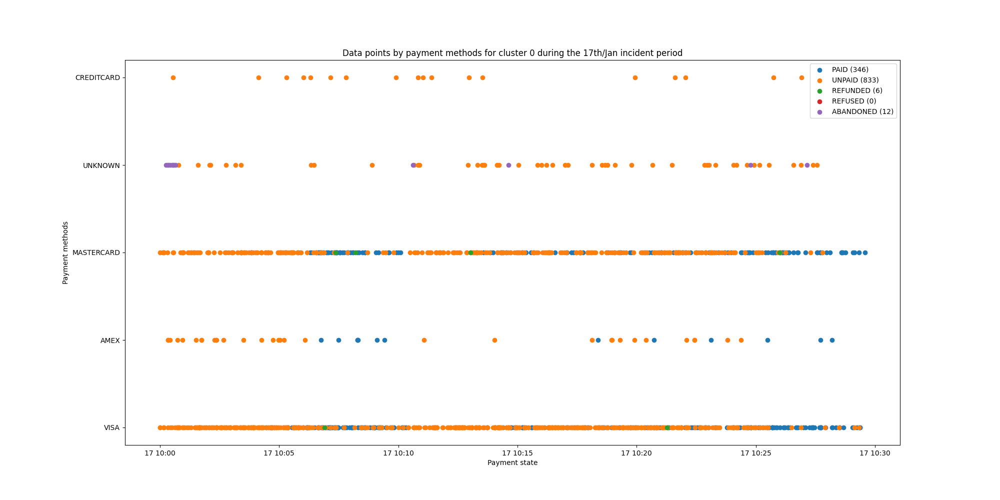
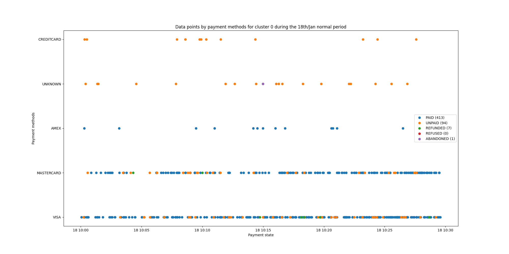
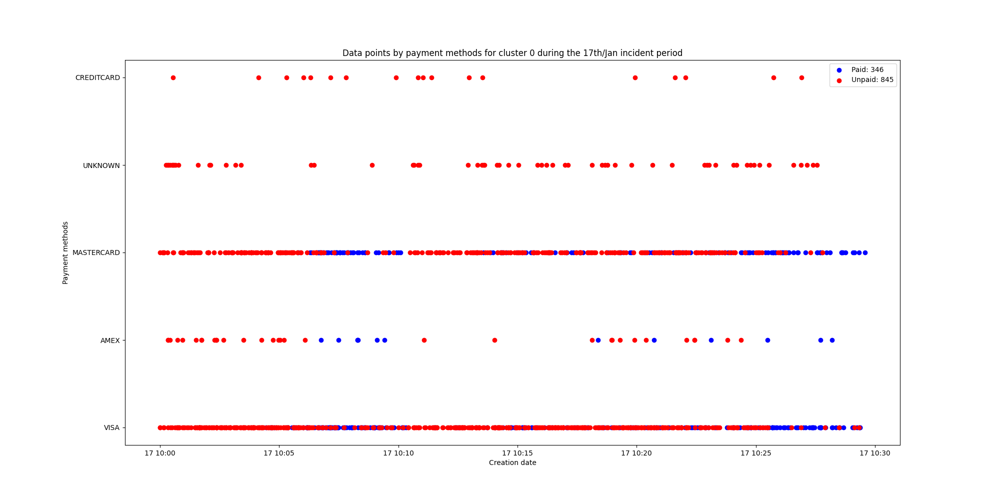
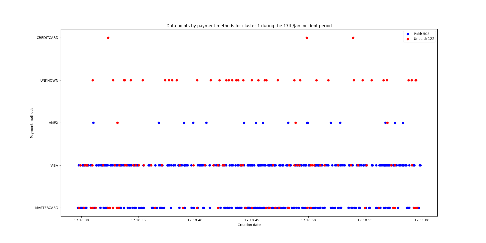
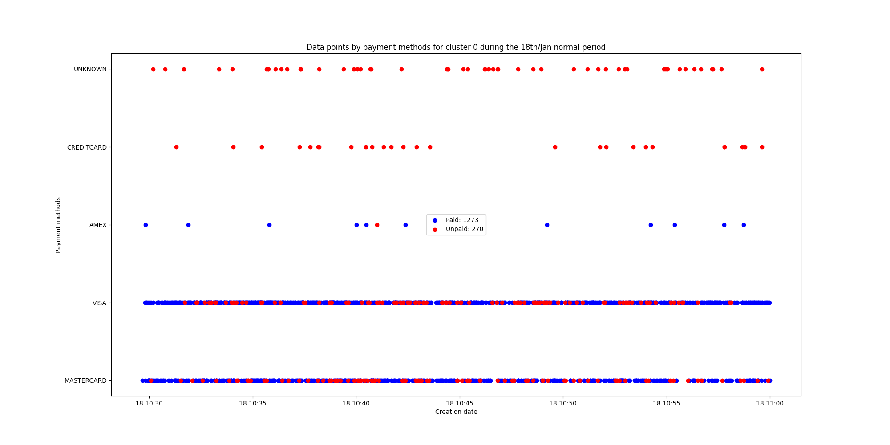
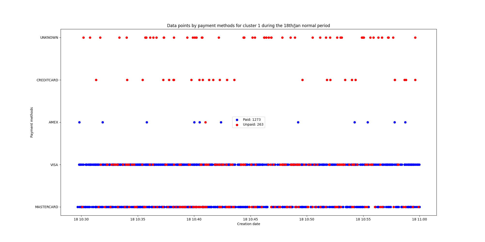

## Transactions (Low level)

17th january 10AM -> incident

Une technique k-means pourrait permettre de detecter des problèmes dans les données de transactions, toutefois il est compliqué de les interprétés et encore plus de pouvoir les distinguées. Dans le cas essayer, 3 clusters sont trouvés mais il ne distingue pas uniquement les transactions anormales, seulement la calcul moyen du nombre de transaction reussi et echoué permettent de trouver lequel est le plus anormal.
Pour reussir a avoir cette information il a été necessaire de trouver un moment ou il y a eu un incident et de chercher précisement dans les données clusterisées pour trouver le cluster qui correspondait a l'incident et même avec cela il est complexe d'en être completement sur.

Les données ont besoin d'etre transformer pour pouvoir être process ce qui les rends difficilement interpretable car il y a beaucoup de possiblités
- Voir si on garde tout les payment_state pour ensuite afficher les clusters basé sur cela

Dans le cas de l'algorithme K-means, deux types de données ont été utilisées, les données des transactions brutes et les données haut niveau (nombre de transactions réussies et échouées par heure). Pour cette partie, les données utilisées ont couvert tout le mois de janvier 2023 et seulement les données étant passées par le PSP Ogone gérant les cartes de crédits, ce qui donne 458'181 transactions. Ce choix est principalement dû à la nature de ces données, en effet le PSP Ogone est celui qui traite le plus de transactions et qui n'a pas d'acquereur (banque) spécialement à lui. De plus, les données de transactions brutes sont très volumineuses et il est donc plus simple de les traiter sur un mois que sur une année entière afin de pouvoir les analyser plus facilement. 
Dans les données brutes voici les champs à disposition : la date de création de la transaction à la milliseconde près, l'identifiant de la transaction, le type de paiement, la méthode de paiement, et l'état finale du paiement. Dans ces attributs de transaction les données ne sont pas toutes essentielles pour l'algorithme, en effet,  l'identifiant de la transaction ainsi que le type de paiement ne sont pas relevant dans ce cas là. En effet, l'identifiant de la transaction est unique et ne permet pas de faire des regroupements de transactions, et le type de paiement est toujours le même étant donné que nous avons filtré les données pour ne garder que les transactions passant par le PSP Ogone. Ensuite, il a fallu transformer les données catégorielles en données numériques afin que l'algorithme puisse les traiter, cela concerne la date de création, la méthode de paiement et l'état finale du paiement. Pour la date de création, il a été décidé de garder une certaine variation temporelle en transformant le timestamp en année, mois, jour, heure, minute et seconde afin d'avoir une granularité plus fine. Bien que dans ce cas l'année et le mois ne change pas dans les données il est important de les gardées pour que si jamais les transactions sont récoltées sur plusieurs années, l'algorithme puisse être en mesure de les traiter. Pour la méthode de paiement, il y a 20 possibilitées différentes, toutefois une partie d'entre elles ne sont pas énormement utilisées et il a donc été décidé de supprimer toute les transactions avec des méthodes de paiements qui ne sont pas utilisées plus de 1000 fois sur le mois. Cela permet de réduire le nombre de caractériques à 12 tout en gardant une bonne représentation des données car uniquement 936 transactions ont été supprimées représentant 0.2% des données. Afin de transformer ces informations catégorielles en données numériques, l'encodage one-hot a été utilisé. Enfin, pour l'état finale du paiement il y a 11 possibilitées mais une partie d'entre eux ne sont pas relevant ou peuvent être regroupées. Dans cette optique, deux types de transformation ont été effectué, la première est de faire un regroupement binaire avec des transactions payées et des transactions non payées. De l'autre d'encoder avec la méthode one-hot l'état des paiements afin qu'ils soient plus précis avec cinq possibilitées : payé, non payé, remboursé, refusé et abandonné.

VISA                    288626
MASTERCARD              168431
UNKNOWN                  49284
KLARNA                   12248
TWINT                    12048
AMEX                     11786
AMAZON_PAY                8539
CREDITCARD                7132
SOFORT                    4249
GIROPAY                   1525
POSTFINANCE_CARD          1491
PAYPAL                    1142
> Tableau représentant la disparité des données suivant la méthode de paiement

PAID          439102
UNPAID        117780
REFUNDED        7627
REFUSED         1314
ABANDONED       1572
> Tableau représentant la disparité des données suivant l'état du paiement

""Suite -> voir si on choisit d'abord une certaine façon de faire sur les 4 ou si on fait les 4 et on compare les résultats (mais demande de choisir comment on décide si oui ou non on considère que c'est un incident)""

La première étape après avoir préparé les données est de trouver le nombre de clusters à utiliser. Pour cela, il a été décidé d'utiliser la méthode du coude qui consiste à calculer la somme des distances au carré de chaque point à son centroïde, puis de comparer le résultat obtenu avec le connaissance du domaine. Dans cette optique, la méthode du coude nous informe qu'il faudrait quatre clusters afin de séparer au mieux les données, néanmoins dans notre cas, il serait plus logique d'avoir deux clusters : un pour les transactions  normales et un autre pour les transactions anormales. En outre, lors de l'analyse d'un cas en utilisant quatre et deux clusters respectivement, quatre clusters ne donne pas une vision plus claire des données et complique la décision du choix de décider dans quel mesure affirmer qu'un groupement défini les transactions anormales. C'est pourquoi il a été convenu de choisir deux clusters pour la suite de l'analyse.
La deuxième décision qu'il a fallu prendre est par rapport à la transformation de l'attribut de l'état du paiement, est-ce qu'il est préférable de choisir la transformation binaire ou celle avec cinq possibilitées. Dans ce but, deux prédictions sur deux jours et heures ont été réalisé afin d'analyser la répartition des résultats obtenues. Ce qui a pu en être ressorti est que la différenciation en cinq catégories ne permet pas d'avoir de meilleures résultats tout en n'avant pas de réel impacte sur la décision du cluster à assigner à une transaction, ce qui est principalement dû au fait que les transactions payés et non payés sont le plus représenté.

    
    

    
    

Maintenant que les données sont prêtes ainsi que les hyper paramètres de l'algorithme, l'évaluation du modèle peut commencer. Tout d'abord il faut determiné lequel des deux clusters est celui représentant les données dites anormales, pour y parvenir il a été décidé d'utiliser une fenêtre de données d'une heure et de choisir quatre date différentes dont une a eu un problème. La décision de choisir une fenêtre d'une durée de une heure permet d'avoir assez de transactions afin de pouvoir avoir une plus grande confidence sur l'analyse.

    
    

    
    

Si on calcul le pourcentage que représente les transactions payées et non payées suivant les clusters voici ce que l'on peut obtenir :
17th
20.79% (635)
71.09% (1197)

18th
17.50% (1543)
19.81% (515)

19th
18.75% (400)
19.24% (447)

Night
35.00% (20)
30.43% (23)

La première chose qu'il ressort de l'étude des clusters est qu'il semble que basé sur les représentations et les calculs statistiques, il semblerait que l'algorithme pourrait permettre de détecter des problèmes dans les données de transactions. Cependant, une autre chose ressort clairement de ces représentations et c'est l'axe X représentant le temps, comme on peut le voir l'algorithme K-means ne sépare pas les données basé sur une compréhension de l'état du paiement, mais sépare les données basé sur les minutes. Le cluster 0 représente les données de la deuxième moitié de l'heure et le cluster 1 de la première partie de l'heure. Si on choisit de prendre des données dans un temps plus cours comme 15 ou 30 minutes alors les résultats n'ont plus aucune valeur avec un cluster qui contient la grande majorité des transactions et l'autre quasiement rien. En voyant cela on peut se dire d'enlever le timestamp pour voir comment il réagit mais cela change la séparation des données basé sur la méthode de paiement ce qui ne permet toujours pas de detecter ce que l'on veut. Avec cette analyse, il est dangereux de se baser sur une technique de se genre car elle n'est pas maniable et montre que l'algorithme ne comprend pas la base sous jacente des données, ce qui pourrait amener a des conclusions erronées et engendrer des problèmes. C'est pourquoi cette technique utilisant des données brutes de transaction est écartée des potentielles solutions viables.

Isolation forest

With 0.237 contamination

17th january 10AM with one-hot
**General**
 1    1189
-1     643
**payment_method VISA**
 1    874
-1    143

**payment_method MASTERCARD** 
-1    317
 1    315

**payment_method UNKNOWN**
-1    98

**payment_method AMEX**
-1    64

**payment_method CREDITCARD**
-1    21

18th january 10AM with one-hot
**General**
1    1730
-1     328
**payment_method VISA**
 1    1060
-1      76

**payment_method MASTERCARD**
 1    670
-1    116

**payment_method UNKNOWN**
-1    73

**payment_method AMEX**
-1    25

**payment_method CREDITCARD**
-1    38

17th january 10AM with binary
**General**
 1    1270
-1     562
**payment_method VISA**
 1    899
-1    118

**payment_method MASTERCARD**
 1    371
-1    261

**payment_method UNKNOWN**
-1    98

**payment_method AMEX**
-1    64

**payment_method CREDITCARD**
-1    21

18th january 10AM with binary
**General**
1    1775
-1     283
**payment_method VISA**
 1    1117
-1      19

**payment_method MASTERCARD**
 1    658
-1    128

**payment_method UNKNOWN**
-1    73

**payment_method AMEX**
-1    25

**payment_method CREDITCARD**
-1    38

Dans le cas des données brutes, il n'y a aucun élément permettant de distinguer les transactions anormales des transactions normales. La seule information pouvant être ressorties est que lors d'une période d'incident un plus grand nombre de transactions finissent dans un état non payé ou abandonné, mais cela suggère que l'algorithme doit être capable de remarquer cela. Or dans le cas de la forêt d'isolation, l'algorithme va principalement essayer de décomposer les données suivant les attributs afin de trouver celles qui sont les plus anormales comparé à la moyenne générale. 

## High Level
### K-means
**Percentage + transaction count**
0    2086
1       9
2    1529

                     percentage  total_transaction_count
2023-07-18 18:00:00        49.2                   1192.0
2023-07-24 00:00:00        50.7                    343.0
2023-08-01 09:00:00        60.5                    736.0
2023-08-02 01:00:00        56.0                    159.0
2023-08-17 03:00:00        54.4                    215.0
2023-08-17 04:00:00        62.6                    155.0
2023-08-28 10:00:00        10.3                   1736.0
2023-08-28 11:00:00        57.5                   1153.0
2023-09-19 09:00:00        57.3                    773.0

**Percentage**
0     944
1       8
2    2672

                     percentage
2023-07-18 18:00:00        49.2
2023-07-24 00:00:00        50.7
2023-08-01 09:00:00        60.5
2023-08-02 01:00:00        56.0
2023-08-17 03:00:00        54.4
2023-08-28 10:00:00        10.3
2023-08-28 11:00:00        57.5
2023-09-19 09:00:00        57.3

**Percentage + date**
0    1378
1    2218
2      28

                     percentage      year     month       day      hour  minute  second
2023-07-08 01:00:00        64.9  1.024647  0.141167 -0.875167 -1.516862     0.0     0.0
2023-07-15 01:00:00        65.1  1.024647  0.141167 -0.077768 -1.516862     0.0     0.0
2023-07-18 18:00:00        49.2  1.024647  0.141167  0.263974  0.939010     0.0     0.0
2023-07-19 08:00:00        65.4  1.024647  0.141167  0.377888 -0.505621     0.0     0.0
2023-07-23 01:00:00        65.6  1.024647  0.141167  0.833545 -1.516862     0.0     0.0
2023-07-24 00:00:00        50.7  1.024647  0.141167  0.947459 -1.661325     0.0     0.0
2023-08-01 09:00:00        60.5  1.024647  0.431478 -1.672566 -0.361158     0.0     0.0
2023-08-02 01:00:00        56.0  1.024647  0.431478 -1.558652 -1.516862     0.0     0.0
2023-08-08 00:00:00        66.5  1.024647  0.431478 -0.875167 -1.661325     0.0     0.0
2023-08-11 06:00:00        66.3  1.024647  0.431478 -0.533425 -0.794547     0.0     0.0
2023-08-14 00:00:00        67.3  1.024647  0.431478 -0.191682 -1.661325     0.0     0.0
2023-08-16 01:00:00        67.0  1.024647  0.431478  0.036146 -1.516862     0.0     0.0
2023-08-17 01:00:00        66.7  1.024647  0.431478  0.150060 -1.516862     0.0     0.0
2023-08-17 02:00:00        66.3  1.024647  0.431478  0.150060 -1.372399     0.0     0.0
2023-08-17 03:00:00        54.4  1.024647  0.431478  0.150060 -1.227936     0.0     0.0
2023-08-17 04:00:00        62.6  1.024647  0.431478  0.150060 -1.083473     0.0     0.0
2023-08-18 00:00:00        67.8  1.024647  0.431478  0.263974 -1.661325     0.0     0.0
2023-08-28 00:00:00        67.7  1.024647  0.431478  1.403116 -1.661325     0.0     0.0
2023-08-28 10:00:00        10.3  1.024647  0.431478  1.403116 -0.216695     0.0     0.0
2023-08-28 11:00:00        57.5  1.024647  0.431478  1.403116 -0.072232     0.0     0.0
2023-09-03 06:00:00        65.2  1.024647  0.721788 -1.444738 -0.794547     0.0     0.0
2023-09-17 01:00:00        68.0  1.024647  0.721788  0.150060 -1.516862     0.0     0.0
2023-09-19 09:00:00        57.3  1.024647  0.721788  0.377888 -0.361158     0.0     0.0
2023-10-01 00:00:00        68.2  1.024647  1.012099 -1.672566 -1.661325     0.0     0.0
2023-10-05 03:00:00        67.7  1.024647  1.012099 -1.216910 -1.227936     0.0     0.0
2023-10-20 02:00:00        64.9  1.024647  1.012099  0.491802 -1.372399     0.0     0.0
2023-10-26 03:00:00        66.7  1.024647  1.012099  1.175287 -1.227936     0.0     0.0
2023-11-05 02:00:00        66.7  1.024647  1.302409 -1.216910 -1.372399     0.0     0.0

**Percentage + transaction count + date**
1    2218
0    1378
2      28

                     percentage      year     month       day      hour  minute  second
2023-07-08 01:00:00        64.9  1.024647  0.141167 -0.875167 -1.516862     0.0     0.0
2023-07-15 01:00:00        65.1  1.024647  0.141167 -0.077768 -1.516862     0.0     0.0
2023-07-18 18:00:00        49.2  1.024647  0.141167  0.263974  0.939010     0.0     0.0
2023-07-19 08:00:00        65.4  1.024647  0.141167  0.377888 -0.505621     0.0     0.0
2023-07-23 01:00:00        65.6  1.024647  0.141167  0.833545 -1.516862     0.0     0.0
2023-07-24 00:00:00        50.7  1.024647  0.141167  0.947459 -1.661325     0.0     0.0
2023-08-01 09:00:00        60.5  1.024647  0.431478 -1.672566 -0.361158     0.0     0.0
2023-08-02 01:00:00        56.0  1.024647  0.431478 -1.558652 -1.516862     0.0     0.0
2023-08-08 00:00:00        66.5  1.024647  0.431478 -0.875167 -1.661325     0.0     0.0
2023-08-11 06:00:00        66.3  1.024647  0.431478 -0.533425 -0.794547     0.0     0.0
2023-08-14 00:00:00        67.3  1.024647  0.431478 -0.191682 -1.661325     0.0     0.0
2023-08-16 01:00:00        67.0  1.024647  0.431478  0.036146 -1.516862     0.0     0.0
2023-08-17 01:00:00        66.7  1.024647  0.431478  0.150060 -1.516862     0.0     0.0
2023-08-17 02:00:00        66.3  1.024647  0.431478  0.150060 -1.372399     0.0     0.0
2023-08-17 03:00:00        54.4  1.024647  0.431478  0.150060 -1.227936     0.0     0.0
2023-08-17 04:00:00        62.6  1.024647  0.431478  0.150060 -1.083473     0.0     0.0
2023-08-18 00:00:00        67.8  1.024647  0.431478  0.263974 -1.661325     0.0     0.0
2023-08-28 00:00:00        67.7  1.024647  0.431478  1.403116 -1.661325     0.0     0.0
2023-08-28 10:00:00        10.3  1.024647  0.431478  1.403116 -0.216695     0.0     0.0
2023-08-28 11:00:00        57.5  1.024647  0.431478  1.403116 -0.072232     0.0     0.0
2023-09-03 06:00:00        65.2  1.024647  0.721788 -1.444738 -0.794547     0.0     0.0
2023-09-17 01:00:00        68.0  1.024647  0.721788  0.150060 -1.516862     0.0     0.0
2023-09-19 09:00:00        57.3  1.024647  0.721788  0.377888 -0.361158     0.0     0.0
2023-10-01 00:00:00        68.2  1.024647  1.012099 -1.672566 -1.661325     0.0     0.0
2023-10-05 03:00:00        67.7  1.024647  1.012099 -1.216910 -1.227936     0.0     0.0
2023-10-20 02:00:00        64.9  1.024647  1.012099  0.491802 -1.372399     0.0     0.0
2023-10-26 03:00:00        66.7  1.024647  1.012099  1.175287 -1.227936     0.0     0.0
2023-11-05 02:00:00        66.7  1.024647  1.302409 -1.216910 -1.372399     0.0     0.0

### Isolation forest

Le changement du nombre d'arbres ne change pas les résultats ce qui permet de choisir un nombre faible d'arbre afin d'avoir un modèle rapide.

#### 10 trees
**Percentage with 0.025 contamination**
                     percentage  predictions
2023-07-18 18:00:00        49.2           -1
2023-08-17 03:00:00        54.4           -1
2023-08-28 10:00:00        10.3           -1

**Percentage + transaction count with 0.025 contamination**
29 -1

                     percentage  total_transaction_count  predictions
2023-07-18 10:00:00        75.1                   3516.0           -1
2023-08-03 14:00:00        83.8                   2904.0           -1
2023-08-17 14:00:00        77.8                   2870.0           -1
2023-08-28 10:00:00        10.3                   1736.0           -1
2023-08-31 12:00:00        85.1                   2334.0           -1
2023-09-05 12:00:00        88.1                   2902.0           -1
2023-09-07 12:00:00        84.8                   3067.0           -1
2023-09-14 11:00:00        85.9                   3770.0           -1
2023-09-14 14:00:00        83.6                   2800.0           -1
2023-09-19 12:00:00        86.6                   3479.0           -1
2023-10-02 12:00:00        84.0                   3072.0           -1
2023-10-02 18:00:00        81.8                   2396.0           -1
2023-10-04 13:00:00        82.7                   2167.0           -1
2023-10-10 11:00:00        84.1                   4370.0           -1
2023-10-10 12:00:00        83.9                   2243.0           -1
2023-10-10 13:00:00        83.0                   2282.0           -1
2023-10-12 14:00:00        82.9                   2155.0           -1
2023-10-17 12:00:00        84.4                   6032.0           -1
2023-11-07 10:00:00        84.1                   6107.0           -1
2023-11-07 11:00:00        80.9                   4575.0           -1
2023-11-07 12:00:00        78.5                   3446.0           -1
2023-11-15 10:00:00        85.0                   4136.0           -1
2023-11-15 11:00:00        85.6                   4496.0           -1
2023-11-15 12:00:00        82.8                   3429.0           -1
2023-11-15 13:00:00        82.4                   3368.0           -1
2023-11-15 14:00:00        79.3                   3273.0           -1
2023-11-21 12:00:00        86.6                   5295.0           -1
2023-11-21 13:00:00        80.5                   2228.0           -1
2023-11-23 14:00:00        83.6                   2503.0           -1

**Percentage + date with 0.025 contamination**
 1    3583
-1      41
                     percentage      year     month       day      hour  minute  second  predictions
2023-07-14 22:00:00        72.4  1.024647  0.141167 -0.191682  1.516862     0.0     0.0           -1
2023-07-14 23:00:00        69.0  1.024647  0.141167 -0.191682  1.661325     0.0     0.0           -1
2023-07-16 22:00:00        72.5  1.024647  0.141167  0.036146  1.516862     0.0     0.0           -1
2023-07-18 18:00:00        49.2  1.024647  0.141167  0.263974  0.939010     0.0     0.0           -1
2023-07-19 18:00:00        71.4  1.024647  0.141167  0.377888  0.939010     0.0     0.0           -1
2023-07-22 18:00:00        73.3  1.024647  0.141167  0.719631  0.939010     0.0     0.0           -1
2023-07-23 01:00:00        65.6  1.024647  0.141167  0.833545 -1.516862     0.0     0.0           -1
2023-07-24 00:00:00        50.7  1.024647  0.141167  0.947459 -1.661325     0.0     0.0           -1
2023-07-24 16:00:00        71.4  1.024647  0.141167  0.947459  0.650084     0.0     0.0           -1
2023-07-24 21:00:00        73.2  1.024647  0.141167  0.947459  1.372399     0.0     0.0           -1
2023-07-25 21:00:00        72.7  1.024647  0.141167  1.061373  1.372399     0.0     0.0           -1
2023-07-25 23:00:00        73.5  1.024647  0.141167  1.061373  1.661325     0.0     0.0           -1
2023-07-26 23:00:00        72.7  1.024647  0.141167  1.175287  1.661325     0.0     0.0           -1
2023-07-28 22:00:00        72.5  1.024647  0.141167  1.403116  1.516862     0.0     0.0           -1
2023-07-28 23:00:00        72.7  1.024647  0.141167  1.403116  1.661325     0.0     0.0           -1
2023-07-29 20:00:00        74.0  1.024647  0.141167  1.517030  1.227936     0.0     0.0           -1
2023-07-30 20:00:00        72.9  1.024647  0.141167  1.630944  1.227936     0.0     0.0           -1
2023-07-31 23:00:00        72.1  1.024647  0.141167  1.744858  1.661325     0.0     0.0           -1
2023-08-01 09:00:00        60.5  1.024647  0.431478 -1.672566 -0.361158     0.0     0.0           -1
2023-08-01 23:00:00        72.3  1.024647  0.431478 -1.672566  1.661325     0.0     0.0           -1
2023-08-02 01:00:00        56.0  1.024647  0.431478 -1.558652 -1.516862     0.0     0.0           -1
2023-08-14 23:00:00        70.6  1.024647  0.431478 -0.191682  1.661325     0.0     0.0           -1
2023-08-17 23:00:00        68.5  1.024647  0.431478  0.150060  1.661325     0.0     0.0           -1
2023-08-18 00:00:00        67.8  1.024647  0.431478  0.263974 -1.661325     0.0     0.0           -1
2023-08-21 23:00:00        71.5  1.024647  0.431478  0.605717  1.661325     0.0     0.0           -1
2023-08-22 19:00:00        72.2  1.024647  0.431478  0.719631  1.083473     0.0     0.0           -1
2023-08-28 00:00:00        67.7  1.024647  0.431478  1.403116 -1.661325     0.0     0.0           -1
2023-08-28 10:00:00        10.3  1.024647  0.431478  1.403116 -0.216695     0.0     0.0           -1
2023-08-28 11:00:00        57.5  1.024647  0.431478  1.403116 -0.072232     0.0     0.0           -1
2023-09-18 20:00:00        84.0  1.024647  0.721788  0.263974  1.227936     0.0     0.0           -1
2023-10-11 23:00:00        84.8  1.024647  1.012099 -0.533425  1.661325     0.0     0.0           -1
2023-10-15 21:00:00        84.0  1.024647  1.012099 -0.077768  1.372399     0.0     0.0           -1
2023-10-16 20:00:00        83.9  1.024647  1.012099  0.036146  1.227936     0.0     0.0           -1
2023-10-24 21:00:00        84.3  1.024647  1.012099  0.947459  1.372399     0.0     0.0           -1
2023-10-29 19:00:00        84.5  1.024647  1.012099  1.517030  1.083473     0.0     0.0           -1
2023-10-29 20:00:00        83.7  1.024647  1.012099  1.517030  1.227936     0.0     0.0           -1
2023-11-01 01:00:00        89.1  1.024647  1.302409 -1.672566 -1.516862     0.0     0.0           -1
2023-11-12 21:00:00        85.8  1.024647  1.302409 -0.419511  1.372399     0.0     0.0           -1
2023-11-19 21:00:00        84.3  1.024647  1.302409  0.377888  1.372399     0.0     0.0           -1
2023-11-23 20:00:00        83.8  1.024647  1.302409  0.833545  1.227936     0.0     0.0           -1
2023-11-26 19:00:00        84.4  1.024647  1.302409  1.175287  1.083473     0.0     0.0           -1

**Percentage + transaction count + date with 0.015 contamination**
 1    3569
-1      55
                     percentage  total_transaction_count      year     month       day      hour  minute  second  predictions
2023-07-01 14:00:00        81.9                   1198.0  1.024647  0.141167 -1.672566  0.361158     0.0     0.0           -1
2023-07-02 11:00:00        80.1                   1245.0  1.024647  0.141167 -1.558652 -0.072232     0.0     0.0           -1
2023-07-02 12:00:00        83.9                    874.0  1.024647  0.141167 -1.558652  0.072232     0.0     0.0           -1
2023-07-02 20:00:00        83.4                   1304.0  1.024647  0.141167 -1.558652  1.227936     0.0     0.0           -1
2023-07-02 21:00:00        83.8                   1424.0  1.024647  0.141167 -1.558652  1.372399     0.0     0.0           -1
2023-07-02 22:00:00        81.7                   1112.0  1.024647  0.141167 -1.558652  1.516862     0.0     0.0           -1
2023-07-03 08:00:00        85.0                    287.0  1.024647  0.141167 -1.444738 -0.505621     0.0     0.0           -1
2023-07-05 11:00:00        84.0                    930.0  1.024647  0.141167 -1.216910 -0.072232     0.0     0.0           -1
2023-07-08 11:00:00        82.3                   1168.0  1.024647  0.141167 -0.875167 -0.072232     0.0     0.0           -1
2023-07-15 23:00:00        82.1                   1615.0  1.024647  0.141167 -0.077768  1.661325     0.0     0.0           -1
2023-07-24 00:00:00        50.7                    343.0  1.024647  0.141167  0.947459 -1.661325     0.0     0.0           -1
2023-07-31 00:00:00        77.0                    244.0  1.024647  0.141167  1.744858 -1.661325     0.0     0.0           -1
2023-08-01 16:00:00        79.0                   1618.0  1.024647  0.431478 -1.672566  0.650084     0.0     0.0           -1
2023-08-01 17:00:00        80.0                   1466.0  1.024647  0.431478 -1.672566  0.794547     0.0     0.0           -1
2023-08-01 18:00:00        80.1                   1490.0  1.024647  0.431478 -1.672566  0.939010     0.0     0.0           -1
2023-08-02 08:00:00        80.5                    365.0  1.024647  0.431478 -1.558652 -0.505621     0.0     0.0           -1
2023-08-03 14:00:00        83.8                   2904.0  1.024647  0.431478 -1.444738  0.361158     0.0     0.0           -1
2023-08-03 15:00:00        80.1                   1395.0  1.024647  0.431478 -1.444738  0.505621     0.0     0.0           -1
2023-08-17 15:00:00        74.4                   1642.0  1.024647  0.431478  0.150060  0.505621     0.0     0.0           -1
2023-08-17 17:00:00        70.7                   1720.0  1.024647  0.431478  0.150060  0.794547     0.0     0.0           -1
2023-08-28 00:00:00        67.7                    226.0  1.024647  0.431478  1.403116 -1.661325     0.0     0.0           -1
2023-08-28 10:00:00        10.3                   1736.0  1.024647  0.431478  1.403116 -0.216695     0.0     0.0           -1
2023-08-31 00:00:00        70.5                    251.0  1.024647  0.431478  1.744858 -1.661325     0.0     0.0           -1
2023-08-31 11:00:00        80.8                   1277.0  1.024647  0.431478  1.744858 -0.072232     0.0     0.0           -1
2023-08-31 12:00:00        85.1                   2334.0  1.024647  0.431478  1.744858  0.072232     0.0     0.0           -1
2023-08-31 14:00:00        80.1                   1359.0  1.024647  0.431478  1.744858  0.361158     0.0     0.0           -1
2023-08-31 15:00:00        79.8                   1378.0  1.024647  0.431478  1.744858  0.505621     0.0     0.0           -1
2023-09-02 00:00:00        78.7                    225.0  1.024647  0.721788 -1.558652 -1.661325     0.0     0.0           -1
2023-09-02 08:00:00        79.3                    270.0  1.024647  0.721788 -1.558652 -0.505621     0.0     0.0           -1
2023-09-05 12:00:00        88.1                   2902.0  1.024647  0.721788 -1.216910  0.072232     0.0     0.0           -1
2023-09-07 11:00:00        85.6                   1462.0  1.024647  0.721788 -0.989082 -0.072232     0.0     0.0           -1
2023-09-07 12:00:00        84.8                   3067.0  1.024647  0.721788 -0.989082  0.072232     0.0     0.0           -1
2023-09-14 11:00:00        85.9                   3770.0  1.024647  0.721788 -0.191682 -0.072232     0.0     0.0           -1
2023-09-14 14:00:00        83.6                   2800.0  1.024647  0.721788 -0.191682  0.361158     0.0     0.0           -1
2023-09-19 12:00:00        86.6                   3479.0  1.024647  0.721788  0.377888  0.072232     0.0     0.0           -1
2023-09-30 00:00:00        78.4                    259.0  1.024647  0.721788  1.630944 -1.661325     0.0     0.0           -1
2023-10-02 12:00:00        84.0                   3072.0  1.024647  1.012099 -1.558652  0.072232     0.0     0.0           -1
2023-10-10 11:00:00        84.1                   4370.0  1.024647  1.012099 -0.647339 -0.072232     0.0     0.0           -1
2023-10-17 12:00:00        84.4                   6032.0  1.024647  1.012099  0.150060  0.072232     0.0     0.0           -1
2023-10-30 00:00:00        85.3                    217.0  1.024647  1.012099  1.630944 -1.661325     0.0     0.0           -1
2023-10-31 00:00:00        80.0                    200.0  1.024647  1.012099  1.744858 -1.661325     0.0     0.0           -1
2023-10-31 07:00:00        81.2                    202.0  1.024647  1.012099  1.744858 -0.650084     0.0     0.0           -1
2023-10-31 09:00:00        82.9                    824.0  1.024647  1.012099  1.744858 -0.361158     0.0     0.0           -1
2023-10-31 10:00:00        84.4                   1216.0  1.024647  1.012099  1.744858 -0.216695     0.0     0.0           -1
2023-10-31 12:00:00        83.6                    948.0  1.024647  1.012099  1.744858  0.072232     0.0     0.0           -1
2023-11-01 01:00:00        89.1                    339.0  1.024647  1.302409 -1.672566 -1.516862     0.0     0.0           -1
2023-11-01 10:00:00        84.5                   1159.0  1.024647  1.302409 -1.672566 -0.216695     0.0     0.0           -1
2023-11-02 03:00:00        87.6                    153.0  1.024647  1.302409 -1.558652 -1.227936     0.0     0.0           -1
2023-11-07 10:00:00        84.1                   6107.0  1.024647  1.302409 -0.989082 -0.216695     0.0     0.0           -1
2023-11-09 15:00:00        87.5                   1670.0  1.024647  1.302409 -0.761253  0.505621     0.0     0.0           -1
2023-11-15 10:00:00        85.0                   4136.0  1.024647  1.302409 -0.077768 -0.216695     0.0     0.0           -1
2023-11-15 11:00:00        85.6                   4496.0  1.024647  1.302409 -0.077768 -0.072232     0.0     0.0           -1
2023-11-21 12:00:00        86.6                   5295.0  1.024647  1.302409  0.605717  0.072232     0.0     0.0           -1
2023-11-21 15:00:00        81.8                   1654.0  1.024647  1.302409  0.605717  0.505621     0.0     0.0           -1
2023-11-23 14:00:00        83.6                   2503.0  1.024647  1.302409  0.833545  0.361158     0.0     0.0           -1